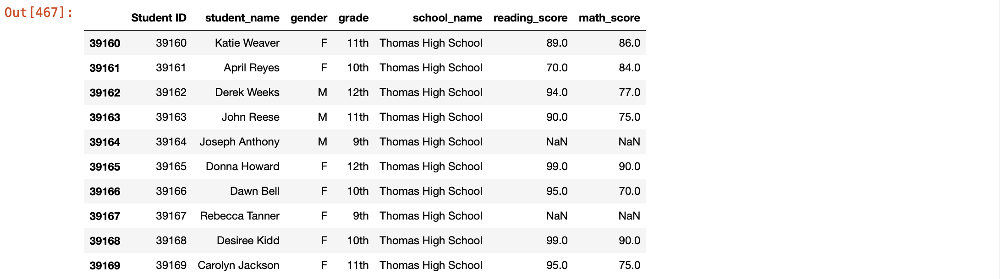
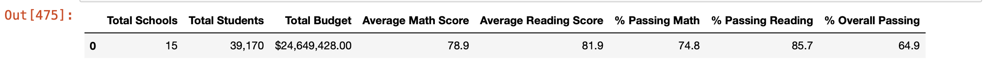

# School_District_Analysis

## Project Overview
The goal of this project is to analyze the data of an entire school district, such as funding and grades, in order to gain new insights and visualize the results. This anlysis was also conducted twice to uphold state-testing standards. Effects of leaving out potential unclean data also discussed.

## Resources
Python 3.7, Anaconda, Jupyter Notebook

## Results
Considering the potential for academic dishonesty amongst the nighth grade students at Thomas High School, This analysis was conducted twice. The first evaluation used the full set of student data. For the second attempt of this analysis, The ninth grade students of Thomas High School had their scores excluded from the calculations. The Dataframe below is a summary of the Distinct after the ninth draders scored have been replaced with NaN.

## Summary
Unforfunately, it is impossible to identify whether certain individuals are engaging in acdemic dishonestly or exclude them from dataset. As a result, the scores of all ninth-gradres from Thomas High School have been left out from the results. This is a suboptimal situation because a full set of data is ideal for creating the most accurate results.

After NaN scores were submitted from ninth gradres scores, Thomas High School's average scores dropped, As well as district-wide avarage math and reading scores. Therefore, Thomas High School lost its placement as a top five school within this District. In contrast, Thomas High School regained its high average score after updating the total student counts to exclude ninth graders from the dataset and excluding their scores.
